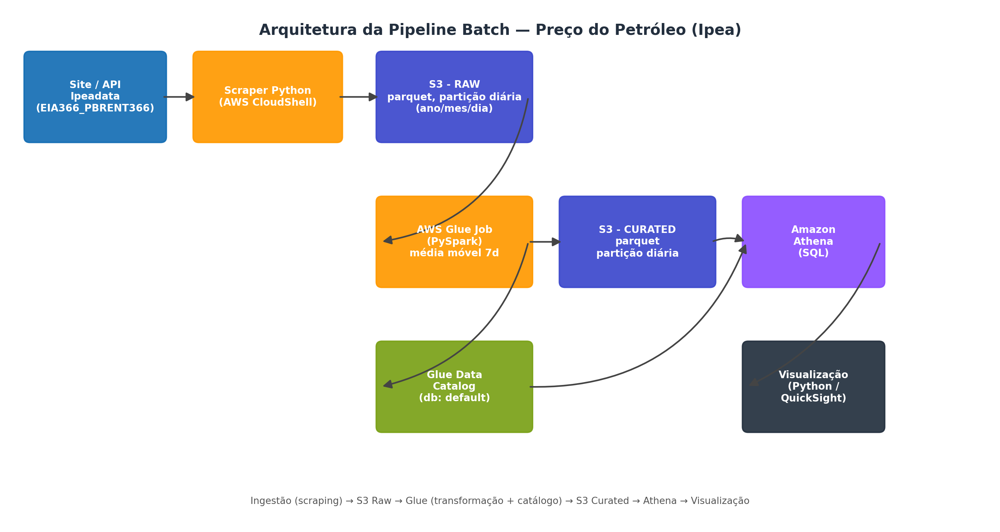

# Pipeline Batch de Dados — Preço do Petróleo Brent (Ipeadata)


Pipeline batch *serverless* na AWS que coleta a série histórica do preço do petróleo Brent
publicada pelo Ipeadata, armazena em Parquet no S3 com partição diária, calcula a **média móvel
de 7 dias** com AWS Glue (PySpark), cataloga a tabela automaticamente no Glue Data Catalog e
disponibiliza os dados para consulta SQL no Amazon Athena.

Projeto desenvolvido como Tech Challenge da Pós Tech FIAP (Machine Learning Engineering).

> **English summary:** batch data pipeline on AWS. Ipea oil price data → S3 (Parquet, daily
> partitions) → Glue PySpark job (7-day moving average, automatic Data Catalog registration) →
> Athena SQL → Python visualization.

**Vídeo de apresentação:** [assistir](COLE-O-LINK-DO-VIDEO-AQUI)

---

## Arquitetura



| Etapa | Serviço | O que faz |
|---|---|---|
| Ingestão | Python (`requests`, `pandas`, `pyarrow`) | Consulta a API OData do Ipeadata e grava Parquet no S3 raw |
| Armazenamento raw | Amazon S3 | `raw/petroleo/ano=YYYY/mes=MM/dia=DD/` (partição diária) |
| Transformação | AWS Glue (PySpark, Glue 4.0) | Calcula a média móvel de 7 dias e grava a camada curated |
| Catalogação | AWS Glue Data Catalog | Tabela `default.petroleo_media_movel` criada automaticamente pelo job |
| Armazenamento curated | Amazon S3 | `curated/petroleo_media_movel/ano=/mes=/dia=/` |
| Consulta | Amazon Athena | SQL sobre a tabela catalogada |
| Visualização | Python (`matplotlib`) | Gráfico de preço diário vs. média móvel |

## Estrutura do repositório

```
.
├── src/
│   ├── ingestion/scrap_ipea.py                 # API do Ipea -> Parquet no S3 (raw)
│   ├── glue/glue_job_media_movel.py            # Glue Job: média móvel + catalogação
│   └── visualization/visualizar_media_movel.py # Athena -> gráfico
├── sql/queries.sql                             # Consultas do Athena
├── docs/
│   ├── architecture/                           # Diagrama e script que o gera
│   └── images/                                 # Gráfico e prints do Athena/Glue
├── requirements.txt
└── README.md
```

## Decisões técnicas

- **Fonte de dados:** o site do Ipeadata monta as páginas via JavaScript, então em vez de
  raspar HTML o projeto consome a API OData pública que alimenta o próprio site
  (série `EIA366_PBRENT366`, preço do petróleo Brent FOB). É a mesma fonte, mais estável e
  sem depender do layout da página.
- **Partição diária:** a camada raw é particionada pela data de ingestão; a camada curated,
  pela data de referência do preço (`ano/mes/dia`), o que permite ao Athena podar partições.
- **Média móvel:** `Window` do Spark com `rangeBetween` sobre a data em segundos, garantindo
  uma janela de 7 dias corridos mesmo quando há dias sem cotação (fins de semana e feriados).
- **Catalogação automática:** o job usa `enableUpdateCatalog=True` e `setCatalogInfo(...)`,
  criando/atualizando a tabela no banco `default` sem precisar de Crawler.
- **Parametrização:** bucket, caminhos e tabela chegam ao Glue Job por parâmetros
  (`getResolvedOptions`); os scripts Python leem `S3_BUCKET` e `AWS_REGION` de variáveis de
  ambiente. Nenhuma credencial ou nome de bucket fica no código.

## Como reproduzir

Pré-requisitos: conta AWS com permissão em S3, Glue e Athena, e o AWS CLI (ou o AWS CloudShell,
que já vem configurado). Os comandos abaixo usam a região `us-east-1`.

**1. Criar o bucket e o banco no Glue Catalog**

```bash
export S3_BUCKET=<seu-bucket-unico>
export AWS_REGION=us-east-1

aws s3 mb s3://$S3_BUCKET --region $AWS_REGION
aws glue create-database --database-input '{"Name":"default"}'   # se ainda não existir
```

**2. Rodar a ingestão**

```bash
pip install -r requirements.txt
python3 src/ingestion/scrap_ipea.py
aws s3 ls s3://$S3_BUCKET/raw/petroleo/ --recursive
```

**3. Criar e executar o Glue Job**

Crie um job Spark (Glue 4.0) com o conteúdo de `src/glue/glue_job_media_movel.py` e uma role
com acesso ao bucket e ao Glue Catalog. Depois:

```bash
aws glue start-job-run --job-name <nome-do-job> --arguments "{
  \"--s3_bucket\":\"$S3_BUCKET\",
  \"--raw_path\":\"raw/petroleo/\",
  \"--curated_path\":\"curated/petroleo_media_movel/\",
  \"--catalog_database\":\"default\",
  \"--catalog_table\":\"petroleo_media_movel\"}"

aws glue get-job-run --job-name <nome-do-job> --run-id <jr_...> --query "JobRun.JobRunState"
```

> Se rodar o job mais de uma vez, limpe a pasta curated antes
> (`aws s3 rm s3://$S3_BUCKET/curated/petroleo_media_movel/ --recursive`), senão os dados
> ficam duplicados e a média móvel é distorcida.

**4. Consultar no Athena**

Defina o local de resultados como `s3://<seu-bucket>/athena-results/`, selecione o banco
`default` e rode as consultas de [`sql/queries.sql`](sql/queries.sql):

```sql
SHOW CREATE TABLE default.petroleo_media_movel;

SELECT data_referencia, preco_petroleo, media_movel_7d
FROM default.petroleo_media_movel
ORDER BY data_referencia DESC
LIMIT 20;
```

**5. Gerar o gráfico**

```bash
python3 src/visualization/visualizar_media_movel.py   # gera media_movel_petroleo.png
```

## Resultados


*Painel superior: histórico completo. Painel inferior: últimos 5 anos, onde a média móvel de
7 dias suaviza a volatilidade diária e evidencia a tendência de curto prazo.*

<!-- Adicione aqui 1 ou 2 prints: tabela no Glue Catalog e resultado da query no Athena,
     salvos em docs/images/. Exemplo:

-->

## Problemas encontrados e aprendizados

| Problema | Causa | Solução |
|---|---|---|
| `Mixed timezones detected` ao converter datas | A API mistura datas com e sem fuso (horário de verão histórico) | `pd.to_datetime(..., utc=True).dt.tz_convert(None)` |
| `arguments are required` no Glue | Parâmetros do job não chegavam pelo console | Execução via CLI com `--arguments` |
| `GlueContext has no attribute dataframe_to_dynamic_frame` | Método inexistente | `DynamicFrame.fromDF(df, glueContext, "nome")` |
| `Database default not found` | Conta nova sem o banco no Glue Catalog | `aws glue create-database` |
| Linhas duplicadas na tabela | Job executado mais de uma vez gravando na mesma pasta | Limpar a pasta curated antes de reexecutar |

## Próximos passos

- Orquestrar a ingestão e o job com EventBridge Scheduler ou Step Functions.
- Tornar a escrita idempotente (modo `overwrite` por partição) para evitar duplicatas.
- Adicionar testes de qualidade de dados (valores nulos, preços negativos, datas faltantes).
- Provisionar a infraestrutura com Terraform ou CloudFormation.
- Publicar o dashboard no Amazon QuickSight.

## Autora

**<Seu nome>** — [LinkedIn](COLE-O-LINK) · [GitHub](COLE-O-LINK)

## Fonte dos dados

Ipeadata — série *Preço por barril do petróleo bruto Brent (FOB)*, publicada pelo Instituto de
Pesquisa Econômica Aplicada (Ipea). Os dados pertencem à fonte original; este repositório
contém apenas o código de coleta e análise.
